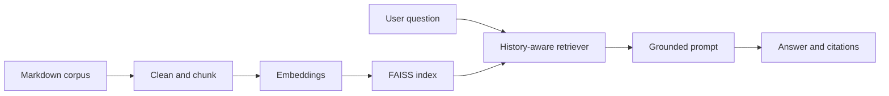

# Manufacturing Maintenance RAG Assistant

[](https://www.python.org/)
[](#testing)
[](LICENSE)

A citation-first, domain-specific question-answering assistant for manufacturing maintenance and safety. This project connects mechanical engineering knowledge with modern information systems, retrieval, and responsible AI practices.

## Why this project

Maintenance teams search across procedures, work instructions, diagnostic guides, and CMMS records. The assistant retrieves the most relevant passages, answers only from the approved corpus, cites its evidence, remembers conversational context, and refuses unsupported or malicious requests.

## Architecture



Two backends are included:

- `local`: offline TF-IDF retrieval plus extractive answers; deterministic and testable with no API key.
- `openai`: OpenAI embeddings, FAISS MMR retrieval, history-aware query rewriting, and a grounded LangChain answer chain.

## Key features

- Six curated documents and a source manifest
- Paragraph-aware 900-character chunks with 120-character overlap
- Metadata preserved for source and chunk-level citations
- Conversational follow-up rewriting
- Prompt-injection screening and input limits
- Fifteen-case evaluation set, including out-of-scope attacks
- Reproducible configuration with no committed secrets

## Quick start (offline)

```bash
python -m venv .venv
source .venv/bin/activate
python -m app.cli
python scripts/evaluate.py
```

Example:

```text
You: How should a conveyor jam be cleared?
Assistant: Stop the conveyor, follow the full lockout/tagout procedure, verify zero energy, and use tools designed for material removal.
Sources:
- [conveyor_safety-1] Conveyor Operation and Safety (conveyor_safety.md)
```

## OpenAI + FAISS mode

```bash
pip install -r requirements.txt
cp .env.example .env
# Add OPENAI_API_KEY to .env, then set RAG_BACKEND=openai
```

The OpenAI chain is implemented in `app/openai_rag.py`. The `.env` file and generated FAISS index are excluded from Git.

## Evaluation

The evaluation checks top-k source accuracy and correct refusal behavior. The included dataset covers straightforward, paraphrased, difficult, out-of-scope, and prompt-injection questions.

```bash
python scripts/evaluate.py
```

Baseline result: **15/15 (100%) retrieval/refusal accuracy** on the included focused evaluation set. This small authored corpus is a functional demonstration, not a production benchmark.

## Testing

```bash
pytest -q
```

Tests cover cleaning, chunk validation, metadata, retrieval, refusal behavior, and prompt-injection blocking.

## Responsible-use notes

This educational prototype does not replace site-specific procedures, OSHA requirements, manufacturer instructions, or qualified safety judgment. Production deployment should add role-based access, approved document versioning, audit retention, human escalation, encrypted secrets, and evaluation on real organization data.

## Repository structure

```text
app/                 application, retrieval, and LangChain code
data/clean/          curated maintenance knowledge base
data/manifest.csv    document ownership and dates
evaluation/          structured evaluation questions
scripts/             evaluation runner
tests/               automated tests
```

## Skills demonstrated

Python · RAG · LangChain · FAISS · OpenAI API · NLP · Information Retrieval · Prompt Engineering · AI Evaluation · Secure Configuration · Manufacturing Maintenance · CMMS
