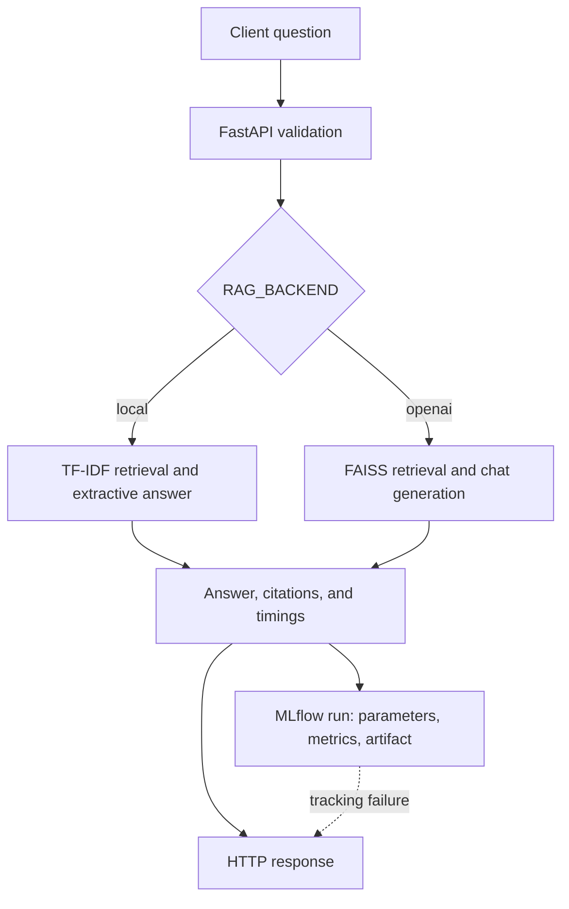
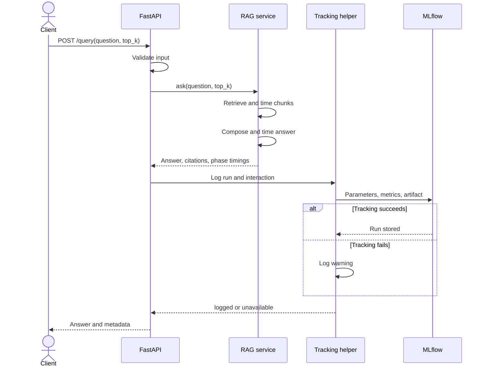
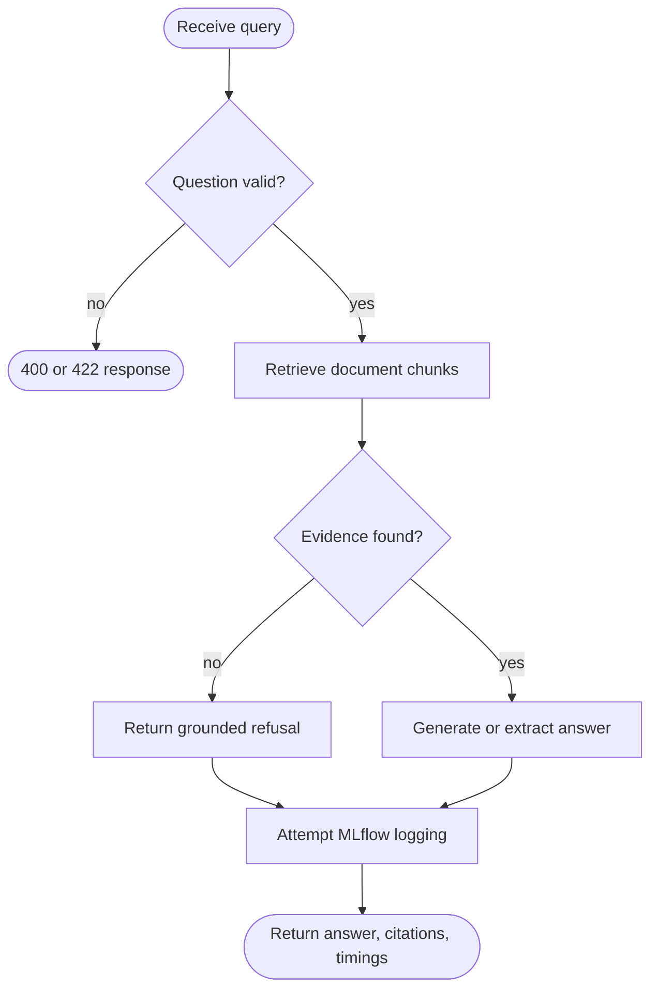
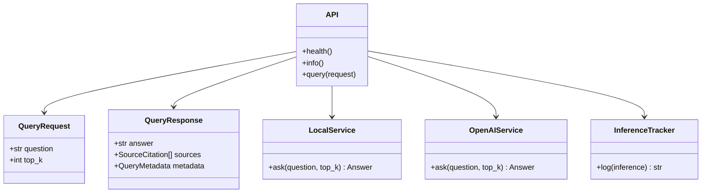

# Architecture and UML diagrams

The service has two RAG backends. `local` retrieves with TF-IDF and composes an extractive answer without credentials. `openai` embeds documents once at startup, uses a FAISS index to retrieve chunks, and generates a grounded answer with the configured chat model. Both return source IDs from the approved corpus.

## System flowchart

## UML sequence diagram

## UML activity diagram

## UML class diagram

## Metadata and boundaries

- Source metadata is limited to chunk ID, document title, and filename. The manifest in `data/manifest.csv` records corpus ownership and dates.
- API metadata contains a generated request ID, actual backend and model, service version, measured phases, and whether tracking succeeded. It never exposes API keys or local filesystem paths.
- MLflow persists each question and answer in `interaction.json`. Use this educational corpus and avoid sending sensitive operational or personal data without a retention and access policy.
- Docker Compose binds the two ports to localhost and uses a named volume for SQLite and artifacts. Production use needs authentication, encrypted transport, access controls, and a more robust backing store.
