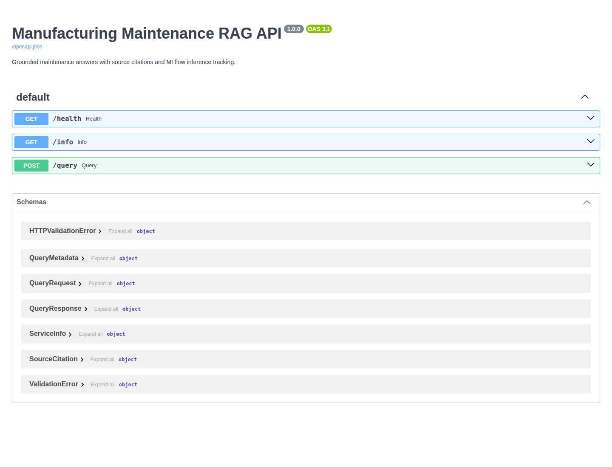
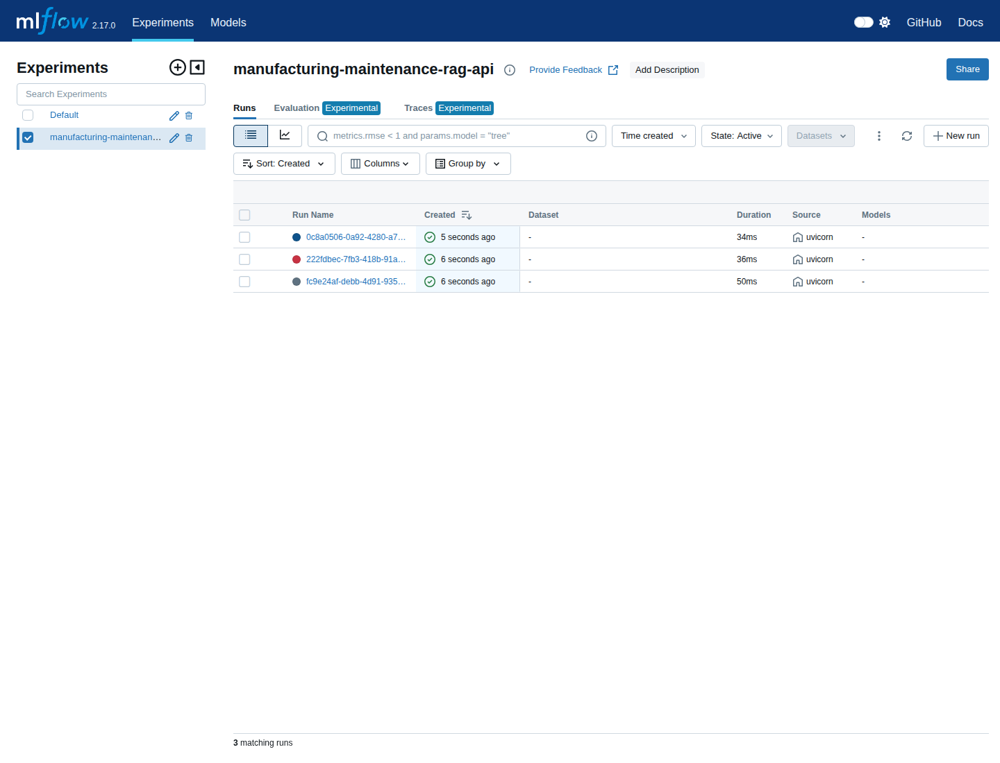
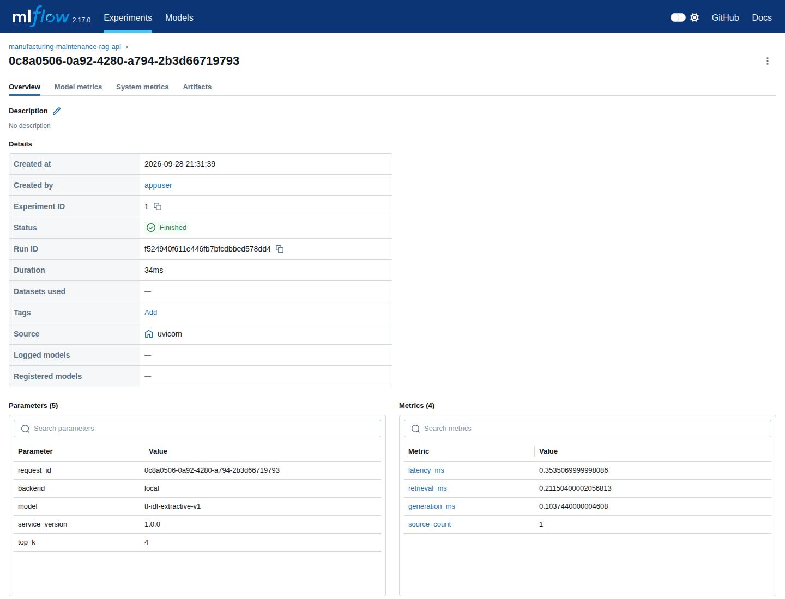

# Verification record

## Local execution, 2026-09-28

Environment: Python 3.12, pinned packages in `requirements.txt`, `RAG_BACKEND=local`, a local MLflow 2.17 tracking server with SQLite and proxied artifacts. No OpenAI key was used.

| Check | Observed result |
|---|---|
| Dependency resolution | `pip check`: no broken requirements after pinning SQLAlchemy 2.0.36 |
| Automated tests | 11 passed; dependency deprecation warnings from Starlette/MLflow |
| Authored retrieval/refusal evaluation | 15/15 cases passed, including three out-of-scope refusals |
| API smoke test | `/health` and `/info` responded; `/query` returned the relevant procedure and a `lockout_tagout.md` citation |
| MLflow live tracking | Query returned `tracking_status=logged`; runs contained parameters, metrics, and `interaction.json` artifacts |
| Latency probe | Three warm-up requests followed by 30 measured queries; p50/p95/p99 in `reports/latency.json` |

The first MLflow startup failed against unbounded SQLAlchemy 2.1.1. Pinning `SQLAlchemy==2.0.36` resolved that incompatibility and the live server and benchmark subsequently ran.

## Container and screenshot evidence

[GitHub Actions run 36486528012](https://github.com/Rajdev-teach/manufacturing-maintenance-rag/actions/runs/36486528012) passed both jobs on 2026-09-28. The `container` job built the image, started API and MLflow with Docker Compose, checked `/health`, `/docs`, three grounded `/query` calls, MLflow metrics, and the `interaction.json` artifact. The `test` job installed pinned dependencies, passed all 11 tests, and ran the 15-case evaluation.

These screenshots were captured from the live Docker Compose stack in that run:

The images prove the local demonstration on the GitHub runner; they do not imply a public deployment.

## Scope of the measurements

The local backend is deterministic and has no external model call. Its answer time is therefore much smaller than a networked LLM's likely time. A future OpenAI-mode benchmark needs a valid key and separate cost/latency reporting. The 15 questions are authored against six short documents; their score does not establish real-world answer accuracy.
